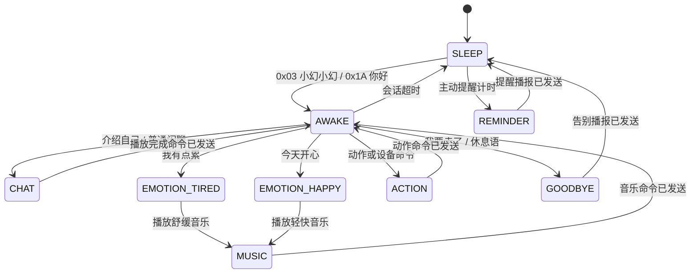

# 语音流转状态机设计

本文档定义 HITune 语音交互的状态机。目标不是把识别到的 ID 直接映射为音轨，而是让主控根据“当前状态 + 语音事件”决定下一步流程，使交互具备唤醒、上下文、情绪分支、音乐分支和设备控制入口。

## 协议对齐

语音识别模块协议来自 `docs/语音交互模块/protocol_commands.md`，标准帧格式为：

`AA 55 CMD PARAM FB`

当前 BSP 的 `Voice_Module_ReadID()` 从 I2C 结果寄存器读取 1 字节，因此代码将“输入事件”定义为协议中的关键字节：

| 类型 | 标准协议 | 当前输入事件 ID | 说明 |
| --- | --- | --- | --- |
| 唤醒词 | `AA 55 03 00 FB` | `0x03` | 官方“小幻小幻”唤醒词 |
| 音量控制 | `AA 55 04/05/06/07/08 00 FB` | `0x04` 到 `0x08` | 直接调整 MP3 模块音量 |
| 播报开关 | `AA 55 09/0A 00 FB` | `0x09`、`0x0A` | 预留播报开关 |
| 动作命令 | `AA 55 0D PARAM FB` | `PARAM` | 当前只取动作参数字节，例如 `0x12` 为打开灯 |
| 播报语 | `AA 55 FF PARAM FB` | `PARAM` | 预留给外部识别结果播报 |
| 兼容闲聊 | `AA 55 00 ID FB` | `0x1A` 到 `0x1E` | 保留现阶段已经跑通的“你好/介绍自己/累/开心/告别”映射 |

注意：现阶段 `0x1A` 被用作“你好”的兼容 ID，而官方动作协议中 `AA 55 0D 1A FB` 表示“招手”。如果语音模块后续改为完整帧输出，应优先在 BSP 层解析出 `CMD` 和 `PARAM`，避免单字节冲突。

## 未修改命令词时的实际触发词

当前如果语音识别模块仍使用原始命令词表，没有改成 `docs/VOICE_COMMANDS.md` 中的“你好/我有点累/今天开心”等闲聊词，那么主控读到的 1 字节 ID 会对应原始表里的命令词。下面这张表用于现场调试：左侧是现在要说的原始命令词，右侧是当前状态机会怎样解释它。

| 当前要说的原始命令词 | 原始协议 | 主控读取 ID | 当前状态机事件 | 当前效果 |
| --- | --- | --- | --- | --- |
| 休息语 | `AA 55 02 00 FB` | `0x02` | `REST` | 播放 `0005.mp3`，进入 `SLEEP` |
| 小幻小幻 | `AA 55 03 00 FB` | `0x03` | `WAKE` | 唤醒，播放 `0001.mp3` |
| 超大音量 | `AA 55 04 00 FB` | `0x04` | `VOLUME_MAX` | 设置音量 30，播放 `0012.mp3` |
| 减小音量 | `AA 55 05 00 FB` | `0x05` | `VOLUME_DOWN` | 音量减 5，播放 `0013.mp3` |
| 最大音量 | `AA 55 06 00 FB` | `0x06` | `VOLUME_MAX` | 设置音量 30，播放 `0012.mp3` |
| 中等音量 | `AA 55 07 00 FB` | `0x07` | `VOLUME_MEDIUM` | 设置音量 20，播放 `0014.mp3` |
| 最小音量 | `AA 55 08 00 FB` | `0x08` | `VOLUME_MIN` | 设置音量 5，播放 `0015.mp3` |
| 停止 / 停下 | `AA 55 0D 09 FB` | `0x09` | `STOP_OR_REPORT` | 唤醒后暂停播放器/停止动作，播放 `0011.mp3` |
| 立正 | `AA 55 0D 0A FB` | `0x0A` | `ACTION` | 唤醒后进入动作分支，播放 `0008.mp3` |
| 趴下 | `AA 55 0D 0B FB` | `0x0B` | `ACTION` | 唤醒后进入动作分支，播放 `0008.mp3` |
| 坐下 | `AA 55 0D 0C FB` | `0x0C` | `ACTION` | 唤醒后进入动作分支，播放 `0008.mp3` |
| 加速 | `AA 55 0D 0D FB` | `0x0D` | `ACTION` | 唤醒后进入动作分支，播放 `0008.mp3` |
| 减速 | `AA 55 0D 0E FB` | `0x0E` | `ACTION` | 唤醒后进入动作分支，播放 `0008.mp3` |
| 打开灯 | `AA 55 0D 12 FB` | `0x12` | `LIGHT_ON` | 唤醒后点亮 LED，播放 `0009.mp3` |
| 关闭灯 | `AA 55 0D 13 FB` | `0x13` | `LIGHT_OFF` | 唤醒后熄灭 LED，播放 `0010.mp3` |
| 招手 | `AA 55 0D 1A FB` | `0x1A` | `HELLO` | 当前被兼容为“你好”，唤醒并播放 `0001.mp3` |
| 介绍自己 | `AA 55 0D 1B FB` | `0x1B` | `SELF_INTRO` | 播放 `0002.mp3` |
| 嗨一下 | `AA 55 0D 1C FB` | `0x1C` | `TIRED` | 当前被兼容为“我有点累”，播放 `0003.mp3`、`0006.mp3` 并播放音乐 1 |
| 走两步 | `AA 55 0D 1D FB` | `0x1D` | `HAPPY` | 当前被兼容为“今天开心”，播放 `0004.mp3`、`0007.mp3` 并播放音乐 2 |
| 点头 | `AA 55 0D 1E FB` | `0x1E` | `GOODBYE` | 当前被兼容为“我要走了”，播放 `0005.mp3` 后休眠 |

因此，在还没改命令词之前，可以先这样测试状态机：

| 想测试的状态机流程 | 现在实际说的命令词 |
| --- | --- |
| 唤醒/你好 | 小幻小幻，或招手 |
| 自我介绍 | 介绍自己 |
| 疲惫安慰分支 | 嗨一下 |
| 开心音乐分支 | 走两步 |
| 告别休眠 | 点头，或休息语 |
| 灯控动作 | 先说小幻小幻，再说打开灯/关闭灯 |

## 状态定义

| 状态 | 含义 | 进入条件 | 退出条件 |
| --- | --- | --- | --- |
| `SLEEP` | 低交互休眠态，只响应唤醒/你好/音量 | 上电、会话结束、超时 | 收到唤醒事件 |
| `AWAKE` | 已唤醒等待命令，播放问候 | `0x03` 或 `0x1A` | 收到命令进入分支，或超时回休眠 |
| `CHAT` | 普通陪伴对话 | 自我介绍、普通闲聊命令 | 完成播报后回 `AWAKE` |
| `EMOTION_TIRED` | 疲惫安慰分支 | “我有点累” | 播放安慰语，可进一步播放舒缓音乐，然后回 `AWAKE` |
| `EMOTION_HAPPY` | 开心回应分支 | “今天开心” | 播放回应语，可进一步播放轻快音乐，然后回 `AWAKE` |
| `MUSIC` | 情绪音乐分支 | 情绪状态触发 | 发送播放音乐命令后回 `AWAKE` |
| `ACTION` | 设备/动作命令分支 | 灯、门、水泵、姿态、移动类命令 | 执行动作或打印日志后回 `AWAKE` |
| `VOLUME` | 音量控制分支 | 音量命令 | 调整音量后回原状态 |
| `GOODBYE` | 告别分支 | “我要走了”或休息语 | 播放告别/休息语后进入 `SLEEP` |
| `REMINDER` | 主动提醒分支 | 空闲计时达到阈值 | 播放提醒后回 `AWAKE` 或 `SLEEP` |

## 主流程

## 事件表

| 命令词 | 协议 | 输入 ID | 任意状态处理 | 唤醒后处理 |
| --- | --- | --- | --- | --- |
| 小幻小幻 | `AA 55 03 00 FB` | `0x03` | 进入 `AWAKE`，播放 `0001.mp3` | 刷新会话超时 |
| 你好 | `AA 55 00 1A FB` | `0x1A` | 兼容唤醒，进入 `AWAKE`，播放 `0001.mp3` | 刷新会话超时 |
| 介绍自己 | `AA 55 00/0D 1B FB` | `0x1B` | 未唤醒时先唤醒 | 进入 `CHAT`，播放 `0002.mp3` |
| 我有点累 | `AA 55 00/0D 1C FB` | `0x1C` | 未唤醒时先唤醒 | 进入 `EMOTION_TIRED`，播放 `0003.mp3`、`0006.mp3`，再播放音乐 1 |
| 今天开心 | `AA 55 00/0D 1D FB` | `0x1D` | 未唤醒时先唤醒 | 进入 `EMOTION_HAPPY`，播放 `0004.mp3`、`0007.mp3`，再播放音乐 2 |
| 我要走了 | `AA 55 00/0D 1E FB` | `0x1E` | 进入 `GOODBYE` | 播放 `0005.mp3` 后休眠 |
| 休息语 | `AA 55 02 00 FB` | `0x02` | 进入 `GOODBYE` | 播放 `0005.mp3` 后休眠 |
| 超大/最大音量 | `AA 55 04/06 00 FB` | `0x04`、`0x06` | 设置音量 30，播放 `0012.mp3` | 设置音量 30，播放 `0012.mp3` |
| 减小音量 | `AA 55 05 00 FB` | `0x05` | 音量减 5，播放 `0013.mp3` | 音量减 5，播放 `0013.mp3` |
| 中等音量 | `AA 55 07 00 FB` | `0x07` | 设置音量 20，播放 `0014.mp3` | 设置音量 20，播放 `0014.mp3` |
| 最小音量 | `AA 55 08 00 FB` | `0x08` | 设置音量 5，播放 `0015.mp3` | 设置音量 5，播放 `0015.mp3` |
| 打开灯 | `AA 55 0D 12 FB` | `0x12` | 未唤醒时播放 `0016.mp3` 并忽略 | 点亮 LED，播放 `0009.mp3`，进入 `ACTION` |
| 关闭灯 | `AA 55 0D 13 FB` | `0x13` | 未唤醒时播放 `0016.mp3` 并忽略 | 熄灭 LED，播放 `0010.mp3`，进入 `ACTION` |
| 停止/停下 | `AA 55 0D 09 FB` | `0x09` | 未唤醒时播放 `0016.mp3` 并忽略 | 唤醒态优先作为停止动作处理，播放 `0011.mp3` |

## 超时与主动提醒

- 主循环 100 ms 轮询一次语音识别寄存器。
- 识别 ID 去重：同一 ID 持续存在时只触发一次，返回 `0x00` 后允许再次触发。
- `AWAKE` 会话窗口默认 12 秒；窗口内每次有效命令都会刷新计时。
- 主动提醒入口默认 5 分钟触发一次，代码会在 `0017.mp3` 到 `0020.mp3` 之间轮换。

## 播放与动作策略

当前 TF 卡语音素材为：

| 音轨 | 文件 | 用途 |
| --- | --- | --- |
| 1 | `0001.mp3` | 唤醒/你好 |
| 2 | `0002.mp3` | 自我介绍 |
| 3 | `0003.mp3` | 疲惫安慰 |
| 4 | `0004.mp3` | 开心回应 |
| 5 | `0005.mp3` | 告别/休息 |
| 6 | `0006.mp3` | 疲惫情绪后的音乐前导 |
| 7 | `0007.mp3` | 开心情绪后的音乐前导 |
| 8 | `0008.mp3` | 通用动作确认 |
| 9 | `0009.mp3` | 打开灯确认 |
| 10 | `0010.mp3` | 关闭灯确认 |
| 11 | `0011.mp3` | 停止动作确认 |
| 12 | `0012.mp3` | 最大音量确认 |
| 13 | `0013.mp3` | 减小音量确认 |
| 14 | `0014.mp3` | 中等音量确认 |
| 15 | `0015.mp3` | 最小音量确认 |
| 16 | `0016.mp3` | 休眠态动作保护提示 |
| 17-20 | `0017.mp3` 到 `0020.mp3` | 主动陪伴提醒轮换 |

情绪音乐使用 MP3-TF-16P 的音乐文件夹接口：

- 疲惫：`Player_PlayMusic(1)`，建议放舒缓音乐。
- 开心：`Player_PlayMusic(2)`，建议放轻快音乐。

动作类命令先以日志和 LED 演示闭环，后续接舵机、电机、水泵时只需要在 `voice_handle_action()` 中补具体驱动，不需要改状态机入口。

## 现场测试流程

以下流程假设语音识别模块还没有修改命令词，仍使用原始命令词表。每说完一句后，等模块识别结果回到 `0x00`，再说下一句，避免主控的 `last_id` 去重逻辑拦截重复命令。

| 步骤 | 现在实际说的命令词 | 主控收到 ID | 期望状态/事件 | 期望现象 |
| --- | --- | --- | --- | --- |
| 1 | 小幻小幻 | `0x03` | `SLEEP -> AWAKE`, `WAKE` | 播放 `0001.mp3`，串口打印唤醒状态 |
| 2 | 介绍自己 | `0x1B` | `AWAKE -> CHAT -> AWAKE`, `SELF_INTRO` | 播放 `0002.mp3` |
| 3 | 嗨一下 | `0x1C` | `AWAKE -> EMOTION_TIRED -> MUSIC -> AWAKE`, `TIRED` | 播放 `0003.mp3`、`0006.mp3`，随后播放音乐 1 |
| 4 | 走两步 | `0x1D` | `AWAKE -> EMOTION_HAPPY -> MUSIC -> AWAKE`, `HAPPY` | 播放 `0004.mp3`、`0007.mp3`，随后播放音乐 2 |
| 5 | 打开灯 | `0x12` | `AWAKE -> ACTION -> AWAKE`, `LIGHT_ON` | LED 常亮，播放 `0009.mp3`，串口打印 `Light on` |
| 6 | 关闭灯 | `0x13` | `AWAKE -> ACTION -> AWAKE`, `LIGHT_OFF` | LED 熄灭，播放 `0010.mp3`，串口打印 `Light off` |
| 7 | 中等音量 | `0x07` | `AWAKE -> VOLUME -> AWAKE`, `VOLUME_MEDIUM` | MP3 音量设置为 20，播放 `0014.mp3` |
| 8 | 减小音量 | `0x05` | `AWAKE -> VOLUME -> AWAKE`, `VOLUME_DOWN` | MP3 音量降低 5，播放 `0013.mp3` |
| 9 | 点头 | `0x1E` | `AWAKE -> GOODBYE -> SLEEP`, `GOODBYE` | 播放 `0005.mp3`，状态回到休眠 |

补充测试：

| 场景 | 操作 | 期望结果 |
| --- | --- | --- |
| 休眠态误触发动作保护 | 上电后不说“小幻小幻”，直接说“打开灯” | 播放 `0016.mp3`，串口打印 `wake word required before action`，LED 不执行灯控动作 |
| 会话超时 | 说“小幻小幻”后 12 秒内不再说命令 | 串口打印 `Session timeout`，状态回到 `SLEEP` |
| 告别快捷入口 | 任意状态说“休息语” | 播放 `0005.mp3`，状态回到 `SLEEP` |
| 兼容唤醒入口 | 说“招手” | 因为 ID 为 `0x1A`，当前会按“你好”处理，播放 `0001.mp3` |
| 主动提醒轮换 | 保持休眠态等待 5 分钟 | 依次播放 `0017.mp3` 到 `0020.mp3`，之后循环 |
