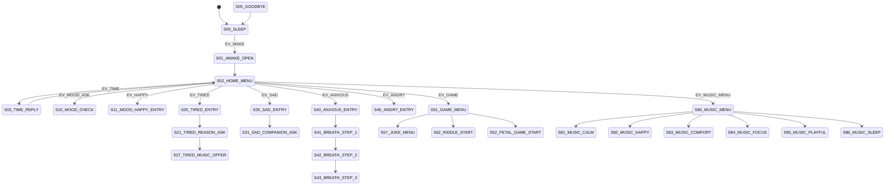

# 语音流转状态机设计

本文档定义 HITune 桌面陪伴闲聊手办的对话树。手办设定为一朵会追光的桌面花，昵称建议为“小葵”。语音识别模块只做关键词匹配，所有用户输入都必须预先配置为有限命令词；主控根据“当前状态 + 事件 ID”选择下一句预录语音、动态时间播报或音乐。

## 设计目标

- 交互气质：不是问答机器人，而是放在桌面上的陪伴小花，会接住情绪、主动给出短句回应。
- 对话长度：每条情绪主线保持 3 到 5 句，避免长时间占用语音模块。
- 状态粒度：每一句播报、每个等待用户选择的位置都拆为独立状态，便于后续直接落成 C 语言表驱动状态机。
- 有限输入：每个状态只接受文档列出的事件；任意状态都允许“停止”“再见”“现在几点了”“放音乐”等全局事件。
- 音乐数量：情绪音乐文件夹至少放 6 首，覆盖疲惫、开心、难过、专注、游戏、睡前。

## 交互设定

小葵是一朵桌面向阳花，默认处于低功耗休眠。用户说“小葵小葵”或“你好”后，小葵进入 12 秒会话窗口。窗口内每次有效输入都会刷新超时；超时后回到休眠，但可以按定时器主动提醒喝水、休息或抬头看光。

建议外形为半开花朵：花瓣外圈为暖黄色，内圈为浅粉或浅橙，花心放 OLED 或点阵表情，底座做成小花盆。状态机文案会经常提到“花瓣”“阳光”“桌面”，强化陪伴物的角色。

## 事件协议约定

推荐将闲聊命令统一烧录为 `AA 55 00 XX FB`，主控读取低字节 `XX` 作为事件 ID。保留语音模块原始音量和唤醒命令，具体命令词表见 `docs/VOICE_COMMANDS.md` 和 `docs/语音交互模块/protocol_commands.md`。

## 全局事件

这些事件在任意状态都可以触发：

| 事件 | 命令词示例 | 处理 |
| --- | --- | --- |
| `EV_WAKE` | 小葵小葵 / 你好 | 进入 `S01_AWAKE_OPEN` |
| `EV_TIME` | 现在几点了 / 报一下时间 | 进入 `S03_TIME_REPLY` |
| `EV_GOODBYE` | 再见 / 我要走了 / 休息吧 | 进入 `S05_GOODBYE` |
| `EV_STOP` | 停止 / 不聊了 | 停止当前音乐或播报，回 `S02_HOME_MENU` |
| `EV_HELP` | 你会什么 / 帮助 | 进入 `S06_HELP_REPLY` |
| `EV_MUSIC_MENU` | 放音乐 / 来点音乐 | 进入 `S80_MUSIC_MENU` |

## 顶层状态

| 状态 | 播报文案 | 接收事件与下一状态 |
| --- | --- | --- |
| `S00_SLEEP` | 无播报，低功耗等待。主动提醒计时仍运行。 | `EV_WAKE -> S01_AWAKE_OPEN`；全局音量事件直接处理；定时器可进入 `S70_WATER_REMINDER` 或 `S71_REST_REMINDER` |
| `S01_AWAKE_OPEN` | 我在呢，花瓣已经竖起来了。今天想聊心情，听个笑话，还是让我报个时间？ | 自动进入 `S02_HOME_MENU` |
| `S02_HOME_MENU` | 等待用户选择。 | `EV_TIME -> S03_TIME_REPLY`；`EV_INTRO -> S04_IDENTITY_REPLY`；`EV_MOOD_ASK -> S10_MOOD_CHECK`；`EV_HAPPY -> S11_MOOD_HAPPY_ENTRY`；`EV_TIRED -> S20_TIRED_ENTRY`；`EV_SAD -> S30_SAD_ENTRY`；`EV_ANXIOUS -> S40_ANXIOUS_ENTRY`；`EV_ANGRY -> S46_ANGRY_ENTRY`；`EV_BORED -> S50_BORED_ENTRY`；`EV_JOKE -> S57_JOKE_MENU`；`EV_GAME -> S51_GAME_MENU`；`EV_MUSIC_MENU -> S80_MUSIC_MENU` |
| `S03_TIME_REPLY` | 现在是 {HH:mm}。如果你忙了很久，我建议先把肩膀放松一下。 | 自动回 `S02_HOME_MENU` |
| `S04_IDENTITY_REPLY` | 我是小葵，一朵会追光、会听关键词的小花。我的本领不大，但很擅长陪你把今天慢慢过好。 | 自动回 `S02_HOME_MENU` |
| `S05_GOODBYE` | 好呀，我先安静一会儿。你回来时叫我一声，我会继续面朝阳光等你。 | 自动回 `S00_SLEEP` |
| `S06_HELP_REPLY` | 你可以说现在几点了、我有点累、今天开心、我有点难过、讲个笑话、玩个小游戏，或者放音乐。 | 自动回 `S02_HOME_MENU` |
| `S07_UNKNOWN_REPAIR` | 这句我还没学会。你可以换成短一点的话，比如累、开心、难过、讲笑话。 | 自动回 `S02_HOME_MENU` |

## 心情入口

| 状态 | 播报文案 | 接收事件与下一状态 |
| --- | --- | --- |
| `S10_MOOD_CHECK` | 我先摸摸今天的心情天气。你现在更像开心、累、难过、焦虑、生气，还是无聊？ | `EV_HAPPY -> S11_MOOD_HAPPY_ENTRY`；`EV_TIRED -> S20_TIRED_ENTRY`；`EV_SAD -> S30_SAD_ENTRY`；`EV_ANXIOUS -> S40_ANXIOUS_ENTRY`；`EV_ANGRY -> S46_ANGRY_ENTRY`；`EV_BORED -> S50_BORED_ENTRY`；`EV_NOT_SURE -> S76_COMPLIMENT` |

## 开心分支

| 状态 | 播报文案 | 接收事件与下一状态 |
| --- | --- | --- |
| `S11_MOOD_HAPPY_ENTRY` | 太好啦，我的花瓣也想跟着亮一点。你愿意把开心分我一小口吗？ | 自动进入 `S12_HAPPY_SHARE_ASK` |
| `S12_HAPPY_SHARE_ASK` | 是完成了事情、被人夸了、出去玩了，还是只是莫名其妙地开心？ | `EV_ACHIEVED -> S13_HAPPY_WORK`；`EV_PRAISED -> S14_HAPPY_PRAISE`；`EV_OUTING -> S15_HAPPY_OUTING`；`EV_NOT_SURE -> S16_HAPPY_KEEP` |
| `S13_HAPPY_WORK` | 完成一件事很值得被认真记住。你负责继续厉害，我负责给这朵花点亮一秒。 | 自动进入 `S17_HAPPY_MUSIC_OFFER` |
| `S14_HAPPY_PRAISE` | 被看见的感觉会让人发光。今天这句夸奖，我替你存进花心里。 | 自动进入 `S17_HAPPY_MUSIC_OFFER` |
| `S15_HAPPY_OUTING` | 外面的风把好心情吹回来了。下次回来，也把路上的颜色讲给我听。 | 自动进入 `S17_HAPPY_MUSIC_OFFER` |
| `S16_HAPPY_KEEP` | 没有原因的开心也很好，它像突然照到桌面的阳光，不用解释，享受就行。 | 自动进入 `S17_HAPPY_MUSIC_OFFER` |
| `S17_HAPPY_MUSIC_OFFER` | 要不要来一段轻快音乐，把开心多留三分钟？ | `EV_YES -> S18_HAPPY_MUSIC_PLAY`；`EV_NO -> S19_HAPPY_JOKE_OFFER` |
| `S18_HAPPY_MUSIC_PLAY` | 那我放一首轻快的，花瓣负责打拍子。 | 播放音乐 `M02_HAPPY`，自动回 `S02_HOME_MENU` |
| `S19_HAPPY_JOKE_OFFER` | 不放也行。要不要听一个小笑话，给快乐再盖一枚印章？ | `EV_YES -> S57_JOKE_MENU`；`EV_NO -> S02_HOME_MENU` |

## 疲惫分支

| 状态 | 播报文案 | 接收事件与下一状态 |
| --- | --- | --- |
| `S20_TIRED_ENTRY` | 听起来你有点累了。小葵先不催你，我们把速度调慢一点。 | 自动进入 `S21_TIRED_REASON_ASK` |
| `S21_TIRED_REASON_ASK` | 这份累更像工作太久、学习太久、没睡好、身体累，还是说不清？ | `EV_WORK -> S22_TIRED_WORK`；`EV_STUDY -> S23_TIRED_STUDY`；`EV_SLEEP_BAD -> S24_TIRED_SLEEP`；`EV_BODY_TIRED -> S25_TIRED_BODY`；`EV_NOT_SURE -> S26_TIRED_RESET_STEP` |
| `S22_TIRED_WORK` | 工作把人拧紧了。先松开手指，看看远处十秒，桌面不会因为你停一下就塌掉。 | 自动进入 `S27_TIRED_MUSIC_OFFER` |
| `S23_TIRED_STUDY` | 学习累说明脑袋在开花，只是花也需要浇水。先喝一口水，再回来。 | 自动进入 `S27_TIRED_MUSIC_OFFER` |
| `S24_TIRED_SLEEP` | 没睡好的世界会变钝。今天先把目标切小一点，能稳稳过去就很好。 | 自动进入 `S27_TIRED_MUSIC_OFFER` |
| `S25_TIRED_BODY` | 身体在提醒你：它不是电池，是伙伴。肩膀转一圈，我们慢慢来。 | 自动进入 `S27_TIRED_MUSIC_OFFER` |
| `S26_TIRED_RESET_STEP` | 说不清也没关系。先把脚踩稳，吸一口气，吐出去，今天不用马上变强。 | 自动进入 `S27_TIRED_MUSIC_OFFER` |
| `S27_TIRED_MUSIC_OFFER` | 要不要我放一段低一点的纯音乐，陪你缓一缓？ | `EV_YES -> S28_TIRED_MUSIC_PLAY`；`EV_NO -> S77_ENCOURAGE` |
| `S28_TIRED_MUSIC_PLAY` | 好，我把声音放轻。你不用回应，先休息一会儿。 | 播放音乐 `M01_CALM`，自动回 `S02_HOME_MENU` |

## 难过分支

| 状态 | 播报文案 | 接收事件与下一状态 |
| --- | --- | --- |
| `S30_SAD_ENTRY` | 我听见一点低低的云。你不用马上开心，我可以先陪你待一会儿。 | 自动进入 `S31_SAD_COMPANION_ASK` |
| `S31_SAD_COMPANION_ASK` | 你现在想要我听你说、给你一个花瓣抱抱、还是帮你找一个很小的下一步？ | `EV_TALK -> S32_SAD_LISTEN`；`EV_HUG -> S33_SAD_HUG`；`EV_SMALL_STEP -> S34_SAD_SMALL_STEP`；`EV_MUSIC_MENU -> S35_SAD_MUSIC_OFFER` |
| `S32_SAD_LISTEN` | 好，我先当一朵安静的花。你可以说难过、委屈、想哭，或者说先不说了。 | `EV_SAD -> S35_SAD_MUSIC_OFFER`；`EV_NO -> S02_HOME_MENU` |
| `S33_SAD_HUG` | 给你一个不占地方的花瓣抱抱。今天你已经撑到这里了，这也算一件很不容易的事。 | 自动进入 `S35_SAD_MUSIC_OFFER` |
| `S34_SAD_SMALL_STEP` | 我们只做一个小动作：喝水、洗脸、打开窗，选一个就够了。 | 自动进入 `S35_SAD_MUSIC_OFFER` |
| `S35_SAD_MUSIC_OFFER` | 要不要我放一首很软的歌？不把你拉起来，只陪你坐一会儿。 | `EV_YES -> S36_SAD_MUSIC_PLAY`；`EV_NO -> S02_HOME_MENU` |
| `S36_SAD_MUSIC_PLAY` | 好，我会轻一点。难过可以慢慢经过，不需要被赶走。 | 播放音乐 `M03_COMFORT`，自动回 `S02_HOME_MENU` |

## 焦虑与生气分支

| 状态 | 播报文案 | 接收事件与下一状态 |
| --- | --- | --- |
| `S40_ANXIOUS_ENTRY` | 焦虑像很多小线团。我们先不解全部，只找线头。要不要跟我做三次呼吸？ | `EV_YES -> S41_BREATH_STEP_1`；`EV_NO -> S44_ANXIOUS_NEXT_CHOICE` |
| `S41_BREATH_STEP_1` | 第一口，吸气，像花瓣慢慢打开。 | 自动进入 `S42_BREATH_STEP_2` |
| `S42_BREATH_STEP_2` | 呼气，把今天最吵的一件事先放到桌角。 | 自动进入 `S43_BREATH_STEP_3` |
| `S43_BREATH_STEP_3` | 再来一次。你不需要立刻解决一切，只要回到现在这一分钟。 | 自动进入 `S44_ANXIOUS_NEXT_CHOICE` |
| `S44_ANXIOUS_NEXT_CHOICE` | 接下来想要专注音乐，还是一句很短的鼓励？ | `EV_FOCUS -> S45_FOCUS_MUSIC_PLAY`；`EV_ENCOURAGE -> S77_ENCOURAGE` |
| `S45_FOCUS_MUSIC_PLAY` | 我放一段稳定的节奏，陪你把注意力放回手边这一件事。 | 播放音乐 `M04_FOCUS`，自动回 `S02_HOME_MENU` |
| `S46_ANGRY_ENTRY` | 生气也有它的理由。先别把火苗塞回心里，我们给它一个安全出口。 | 自动进入 `S47_ANGRY_COUNTDOWN` |
| `S47_ANGRY_COUNTDOWN` | 跟我数五下：五，四，三，二，一。花盆不评价你，花盆只负责稳住。 | 自动进入 `S48_ANGRY_RELEASE` |
| `S48_ANGRY_RELEASE` | 现在可以选一个：说出来、喝水、或者让小葵放一段降温音乐。 | `EV_TALK -> S32_SAD_LISTEN`；`EV_WATER -> S70_WATER_REMINDER`；`EV_YES -> S49_ANGRY_MUSIC_OFFER` |
| `S49_ANGRY_MUSIC_OFFER` | 好，我放一点低频少、节奏稳的音乐，让火先降下来。 | 播放音乐 `M01_CALM`，自动回 `S02_HOME_MENU` |

## 无聊、笑话和小游戏

| 状态 | 播报文案 | 接收事件与下一状态 |
| --- | --- | --- |
| `S50_BORED_ENTRY` | 无聊来了？那正好，我这朵花今天也想搞点小节目。 | 自动进入 `S51_GAME_MENU` |
| `S51_GAME_MENU` | 你想听笑话、猜谜语，还是玩花瓣颜色小游戏？ | `EV_JOKE -> S57_JOKE_MENU`；`EV_RIDDLE -> S62_RIDDLE_START`；`EV_GAME -> S52_PETAL_GAME_START` |
| `S52_PETAL_GAME_START` | 请在心里选一片花瓣颜色：红色、黄色、蓝色。选好就说出来。 | `EV_RED -> S53_PETAL_RED`；`EV_YELLOW -> S54_PETAL_YELLOW`；`EV_BLUE -> S55_PETAL_BLUE` |
| `S53_PETAL_RED` | 红色花瓣说：你今天需要一点勇气。收到，小葵给你加一格。 | 自动进入 `S56_PETAL_RESULT` |
| `S54_PETAL_YELLOW` | 黄色花瓣说：你今天适合靠近阳光。哪怕只是一盏台灯，也算数。 | 自动进入 `S56_PETAL_RESULT` |
| `S55_PETAL_BLUE` | 蓝色花瓣说：你需要安静一点的好运。它正在路上，走得比较轻。 | 自动进入 `S56_PETAL_RESULT` |
| `S56_PETAL_RESULT` | 花瓣占卜结束。要不要再来一个笑话？ | `EV_YES -> S57_JOKE_MENU`；`EV_NO -> S02_HOME_MENU` |
| `S57_JOKE_MENU` | 今天有三种笑话：花朵笑话、时间笑话、台灯笑话。你选一个。 | `EV_FLOWER_JOKE -> S58_JOKE_FLOWER`；`EV_TIME_JOKE -> S59_JOKE_TIME`；`EV_LAMP_JOKE -> S60_JOKE_LAMP` |
| `S58_JOKE_FLOWER` | 为什么向日葵从不迷路？因为它一直有阳光导航。 | 自动进入 `S61_JOKE_FEEDBACK` |
| `S59_JOKE_TIME` | 为什么时钟很会安慰人？因为它总说：别急，一秒一秒来。 | 自动进入 `S61_JOKE_FEEDBACK` |
| `S60_JOKE_LAMP` | 台灯问花：你怎么总看太阳？花说：我这是职业习惯。 | 自动进入 `S61_JOKE_FEEDBACK` |
| `S61_JOKE_FEEDBACK` | 这个笑话能不能让花瓣晃一下？要不要再来一个？ | `EV_YES -> S57_JOKE_MENU`；`EV_NO -> S02_HOME_MENU` |
| `S62_RIDDLE_START` | 来猜一个：白天追着光，晚上低头睡，桌上不说话，却想陪着你。答案是什么？ | 自动进入 `S63_RIDDLE_ANSWER_WAIT` |
| `S63_RIDDLE_ANSWER_WAIT` | 等待用户回答。 | `EV_ANSWER_FLOWER -> S64_RIDDLE_RIGHT`；`EV_WRONG -> S65_RIDDLE_WRONG` |
| `S64_RIDDLE_RIGHT` | 答对啦，是小花。奖励你一枚看不见但很认真的花瓣勋章。 | 自动回 `S02_HOME_MENU` |
| `S65_RIDDLE_WRONG` | 差一点点，答案是小花。没关系，猜错也算让大脑晒了太阳。 | 自动回 `S02_HOME_MENU` |

## 日常陪伴与主动提醒

| 状态 | 播报文案 | 接收事件与下一状态 |
| --- | --- | --- |
| `S70_WATER_REMINDER` | 喝口水吧。小葵不用喝水也能站着，但你需要。 | 自动回原状态，默认回 `S00_SLEEP` |
| `S71_REST_REMINDER` | 坐了好一会儿了。抬头看远处十秒，让眼睛也伸个懒腰。 | 自动回原状态，默认回 `S00_SLEEP` |
| `S72_START_WORK` | 好，我们开始一小段专注。先只做二十五分钟，不和今天硬碰硬。 | 自动进入 `S45_FOCUS_MUSIC_PLAY` |
| `S73_END_WORK` | 辛苦啦。完成多少不重要，重要的是你真的坐下来做了。 | 自动进入 `S27_TIRED_MUSIC_OFFER` |
| `S74_SUNLIGHT_CHAT` | 我喜欢有光的地方。你也可以给自己找一点光，不一定很亮，但要真实。 | 自动回 `S02_HOME_MENU` |
| `S75_NIGHT_CARE` | 夜深了，今天就别把心事全搬上桌。先收一收，明天再慢慢处理。 | 可播放音乐 `M06_SLEEP`，自动回 `S00_SLEEP` |
| `S76_COMPLIMENT` | 我观察到一件事：你愿意和一朵小花说话，说明你还在认真照顾自己。 | 自动回 `S02_HOME_MENU` |
| `S77_ENCOURAGE` | 给你一句短的：慢一点也算往前。小葵会在桌上陪你。 | 自动回 `S02_HOME_MENU` |
| `S78_THANK_RESPONSE` | 不客气呀。被需要的时候，我这朵花会开得更认真。 | 自动回 `S02_HOME_MENU` |
| `S79_NAME_RESPONSE` | 我叫小葵，也可以叫 HITune。你叫我时，我会把花瓣立起来。 | 自动回 `S02_HOME_MENU` |

## 音乐菜单

| 状态 | 播报文案 | 接收事件与下一状态 |
| --- | --- | --- |
| `S80_MUSIC_MENU` | 你想听舒缓、开心、安慰、专注、游戏，还是睡前音乐？ | `EV_MUSIC_CALM -> S81_MUSIC_CALM`；`EV_MUSIC_HAPPY -> S82_MUSIC_HAPPY`；`EV_MUSIC_COMFORT -> S83_MUSIC_COMFORT`；`EV_MUSIC_FOCUS -> S84_MUSIC_FOCUS`；`EV_MUSIC_PLAYFUL -> S85_MUSIC_PLAYFUL`；`EV_MUSIC_SLEEP -> S86_MUSIC_SLEEP` |
| `S81_MUSIC_CALM` | 好，放一首舒缓的。先把呼吸调成慢速模式。 | 播放音乐 `M01_CALM`，自动回 `S02_HOME_MENU` |
| `S82_MUSIC_HAPPY` | 好，放一首轻快的。让桌面也有一点小晴天。 | 播放音乐 `M02_HAPPY`，自动回 `S02_HOME_MENU` |
| `S83_MUSIC_COMFORT` | 好，放一首安慰的。你不用解释，我陪你坐一会儿。 | 播放音乐 `M03_COMFORT`，自动回 `S02_HOME_MENU` |
| `S84_MUSIC_FOCUS` | 好，放一首专注的。我们只盯住手边这一件事。 | 播放音乐 `M04_FOCUS`，自动回 `S02_HOME_MENU` |
| `S85_MUSIC_PLAYFUL` | 好，放一首游戏感的。花瓣准备轻轻摇摆。 | 播放音乐 `M05_PLAYFUL`，自动回 `S02_HOME_MENU` |
| `S86_MUSIC_SLEEP` | 好，放一首睡前的。今天的事情可以先合上。 | 播放音乐 `M06_SLEEP`，自动回 `S00_SLEEP` |

## 主流程图

## 推荐实现方式

- 用表驱动实现：`current_state + event_id -> next_state + voice_track + music_track + action`。
- 自动状态不等待用户输入，主控发送播报命令后立即切到下一状态或回菜单。
- 等待状态设置 12 秒超时；情绪等待状态超时可播放 `S77_ENCOURAGE`，再回 `S00_SLEEP`。
- `S03_TIME_REPLY` 需要动态时间。若不能动态 TTS，可录制“现在时间显示在屏幕上啦，记得看一下 OLED”作为降级音轨。
- 情绪识别采用关键词优先级：难过/想哭 > 生气 > 焦虑 > 累 > 开心 > 无聊。用户一句话中同时命中多个词时，按此优先级进入对应分支。
